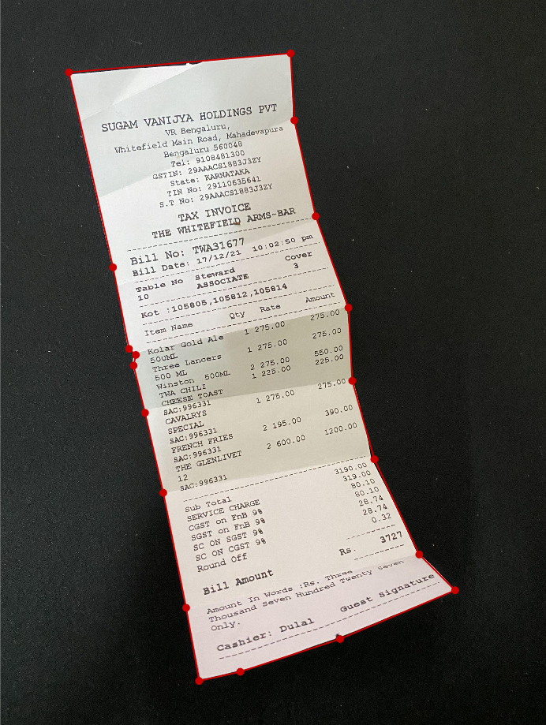
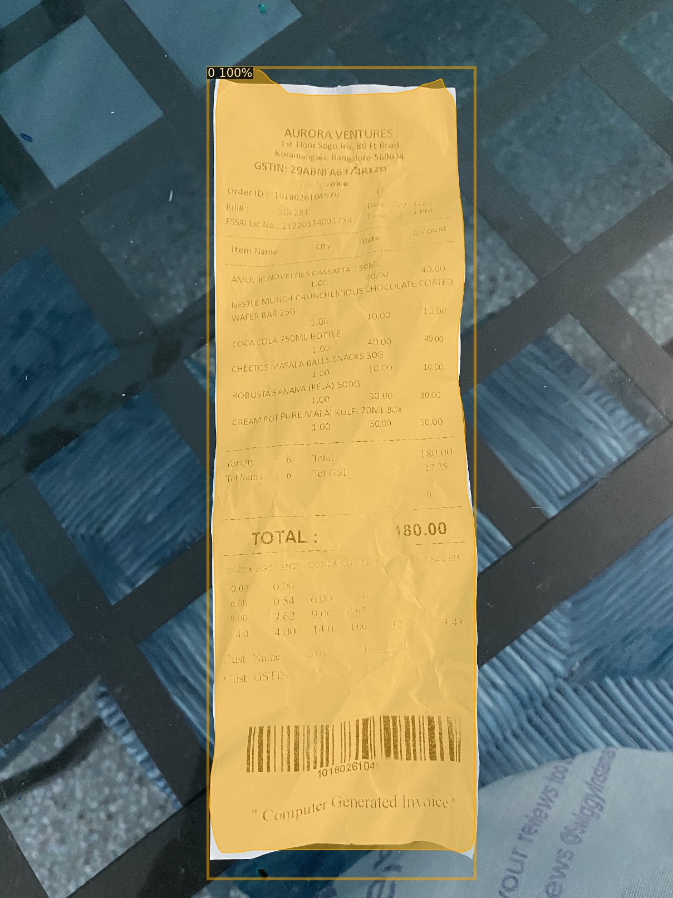

# Automated_Invoice_Processing
## Description
The number of types of physical documents being digitized is on the increase. Medical bills,  bank documents and personal documents are examples of such documents. One type of physical document that is still widely used today is receipts.With the use of smartphones with built-in high-resolution cameras, opportunities for digitizing physical documents arise by converting images to text. Etracting text information can be di- vided into two phases. The first phase involves preprocessing the original im- age and extracting the text from it by running it through an Optical Character Recognition (OCR) engine.
Objective of this repo is to work on extracting text information from any kind of randomly oriented images,In this case we will try extract text information from invoice recipts however same process can be used for different use case.

## Problem statement
The task of extracting the text from a photograph of a receipt is challenging since OCR engines are sensitive to skew . Because photographs captured by smartphones often introduce skew, including both rotation and perspective, a robust automatic system for this task must be tolerant to it. Moreover, the sys- tem should be capable of cropping the original photograph in order to remove
anything that is not a part of the receipt. In other words, the system should be able to automatically preprocess the original photograph by skew correcting and cropping it in order to produce an image that can yield high-quality OCR results.

## Requirements
- Python 3.8.10
- [Torch](https://pytorch.org/get-started/previous-versions/) 1.8.1
- Torchvision 0.9.1
- [Detectron2](https://github.com/facebookresearch/detectron2) 0.6
- [Labelme](https://github.com/wkentaro/labelme)
- Pytesseract 0.3.8

### Training data annotation
Labelme is a graphical image annotation tool which can be used for semantic segmentation, bbox detection and classification annotation, dataset is comparatively small since labeling is done manually on labelme annotation tool around 300 images were annoated. After completing the annotation labelme format is converted to coco which is a suitable format for detectron2 and pytorch framework.
[labelme installation guide](https://medium.com/@tingyan.deng/how-to-download-labelme-for-image-segmentation-tasks-b5668ecd0f29)
  
An example of how each receipt photograph was annotated with a polygon mask using labelme.

### Pytorch
PyTorch is an open-source machine learning library for Python which allows maximum flexibility and speed on scientific computing for deep learning. It is a replacement for NumPy to use the power of GPUs.
[pytorch installation guide](https://medium.com/analytics-vidhya/install-cuda-11-2-cudnn-8-1-0-and-python-3-9-on-rtx3090-for-deep-learning-fcf96c95f7a1)

### Detectron2 
Detectron 2 is a next-generation open-source object detection system from Facebook AI Research. With the repo you can use and train the various state-of-the-art models for detection tasks such as bounding-box detection, instance and semantic segmentation, and person keypoint detection.
[detectron2 installation guide](https://detectron2.readthedocs.io/en/latest/tutorials/install.html)

### Mask RCNN 
Mask R-CNN is a deep neural network aimed to solve instance segmentation problem in machine learning or computer vision. In other words, it can separate different objects in an image or a video. Mask R-CNN (regional convolutional neural network) is a two-stage framework: the first stage scans the image and generates proposals(areas likely to contain an object). And the second stage classifies the proposals and generates bounding boxes and masks. Both stages are connected to the backbone structure.

### Optical Character Recognition
Optical Character Recognition (OCR) is the task of transforming optically pro- cessed characters, both printed and handwritten, into machine-encoded text. Character recognition is a subcategory of the pattern recognition research area.

### Methods
In this project, a receipt is assumed to have the shape of a convex quadrilat- eral. Therefore, locating the receipt in a photograph essentially comes down to predicting the four corner coordinates {(x1, y1), (x2, y2), (x3, y3), (x4, y4)} of the receipt quadrilateral. Using these coordinates, the original photograph can be both skew corrected and cropped. Theoretically, this would result in an image with no skew or background irregularities which could infer noise to the OCR results.

#### Choice of network
In a photograph of a receipt where the receipt is perfectly aligned, meaning that it has no skew, a bounding box predicted by e.g. Faster R-CNN or YOLOv3 would be sufficient to obtain the corner coordinates of the receipt. In this situ- ation, the corner coordinates of the bounding box would translate to the corner coordinates of the receipt quadrilateral. However, in a photograph where the receipt is either rotation skewed or perspective skewed, a bounding box would only give a rough estimation of the location of the receipt. It would not give any information that could be used to determine the corners of the receipt quadrilateral. To effectively determine the corners of the receipt quadrilateral, more nuanced information about the receipt location must be obtained. Because of this, Mask R-CNN was chosen as the DL approach to this problem.

#### Training Mask R-CNN
The Mask R-CNN network was trained using the open-source Detectron2 implemted on pytorch framework.
For custom data training on Mask RCNN you can also use train.py script with couple of changes. Like train images path, train json annot path, config_file_path and number of classes.
you can also refer to this video which was helpful. [click](https://www.youtube.com/watch?v=GoItxr16ae8)

### The DL approach
the central method of the DL approach is to approximate the segmentation mask of the receipt into a quadrilateral. Using the corner coordinates of the quadrilateral, the original photograph is prepro- cessed before extracting its text via OCR.
The output instance segmentations from Mask_RCNN consist of a boolean matrix S with the shape H × W × N, where H is the pixel height of the in- put image, W is the pixel width of the input image and N is the number of instances detected. For each object instance, each value in the 2-dimensional matrix describes whether or not the corresponding pixel in the input image be- longs to that object. More concretely, if a value in the matrix is T rue that pixel belongs to the instance object and if it is F alse it does not. Using the boolean matrix S predicted by Mask R-CNN, a variety of different CV algorithms were applied using OpenCV in order to approximate the quadrilateral.
First, a new binary image is created from S. Canny Edge Detection is applied on this image to extract the edges of the mask. Then, the external contours
are detected using the extracted edges from the previous step. By calculating the external contours, any inner edge components caused by “holes“ in the segmentation mask are discarded. After this, a step towards simplifying the segmentation mask is taken by computing the convex hull of the contours. The convex hull of a shape is the smallest possible convex set that encapsulates it. This greatly simplifies the shape of the mask, making it easier to approximate it into a quadrilateral. Because the shape of the segmentation mask often is highly irregular, this step is crucial.
Even though the mask is now simplified, it is still irregular and not in the shape of a quadrilateral. However, the use of convex hull has clarified possible straight lines in the image, which now will be utilized by applying Hough Line Transform.
